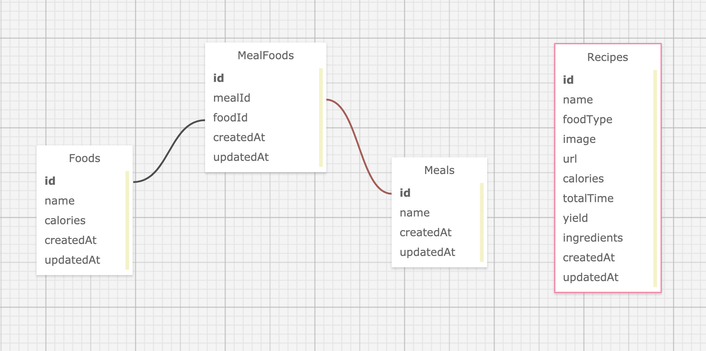

# Project: Recipe Microservice

## Visit the app on Heroku:
https://calm-inlet-?????.herokuapp.com/

## Contributors
* [Sejin Kim](https://github.com/froydroyce)
* [Stella Mainar](https://github.com/smainar)

## About the Project  
* The Recipe Microservice was a paired project completed in 10-days as a requirement for the Turing School of Software and Design, Back-End Engineering Program (Module 4).
* The purpose was to build an independent microservice using the Edamam API to search for recipes with a particular food type (e.g. chicken, potato, etc.).
* A recipes table is built in this microservice.
* Five endpoints are exposed (see below).

## Tech Stack
* Express.js
* Node.js
* Sequelize
* Jest
* PostgreSQL
* JavaScript

## Packages Used
* Axios
* Dotenv

## GitHub Repository
https://github.com/froydroyce/recipe_microservice

## Database Diagram


## Local Setup
  ### Instructions:
      1. Clone the GitHub repository
      2. Go to the directory with the new repo  
      3. Run `npm install`
      4. Setup database:
         a) npx sequelize db:create
         b) npx sequelize db:migrate
      5. To run the server: `npm start`

  ### Run tests:
        1. Run `npm test`
        2. To run a single test file: `npm test -- <file_name>`
        3. To generate coverage report: `open coverage/lcov-report/index.html`


## Endpoints

### 1) User can search for recipes by food type

***Request:***
```
GET /api/v1/recipes/food_search?q=<food_type>
Content-Type: application/json
Accept: application/json
```

***Response Example:***
```
status: 200

body:
{
  "id": 21,
  "name": "Cemitas de Lengua (Mexican Tongue Sandwiches) Recipe",
  "foodType": "cow tongue",
  "image": "https://www.edamam.com/web-img/2ce/2ce073e10b09309d78bc8e3f4572c9bf.jpg",
  "url": "http://www.seriouseats.com/recipes/2012/08/cemita-lengua-tongue-cemita-recipe.html",
  "calories": 2534.93446900752,
  "totalTime": 180,
  "yield": 6,
  "ingredients": [
      "1 cow or veal tongue, about 1 1/2 pounds",
      "2 medium onions",
      "Kosher salt and freshly ground black pepper",
      "3 tablespoons vegetable or canola oil",
      "1 (15 ounce) can black beans, drained, 3 tablespoons liquid reserved",
      "4 to 6 cemita rolls, halved and lightly toasted when ready to serve",
      "2 to 3 ripe avocados",
      "4 ounces fresh Mexican cheese, such as Oaxaca cheese",
      "1 tomato, thinly sliced",
      "A few leaves iceberg lettuce, shredded",
      "1/2 cup crema or sour cream"
  ],
  "updatedAt": "2019-10-14T19:18:31.826Z",
  "createdAt": "2019-10-14T19:18:31.826Z"
}
```

### 2) User can search for recipes by calorie range

***Request:***
```
GET /api/v1/recipes/calorie_search?q=<food_type>&from=<calories_min>&to=<calories_max>
Content-Type: application/json
Accept: application/json
```

***Response Example:***
```
status: 200
body:

[
  {
    "id": 41,
    "name": "Grilled Butterflied Chicken Recipe",
    "foodType": "chicken",
    "image": "https://www.edamam.com/web-img/7a2/7a2f41a7891e8a8f8a087a96930c6463.jpg",
    "url": "http://www.seriouseats.com/recipes/2012/08/grilled-butterflied-chicken-recipe.html",
    "calories": 2499.62848307288,
    "totalTime": 60,
    "yield": 4,
    "ingredients": [
        "1 whole chicken, 3 1/2 to 4 pounds",
        "Kosher salt and freshly ground black pepper"
    ],
    "updatedAt": "2019-10-15T21:17:59.024Z",
    "createdAt": "2019-10-15T21:17:59.024Z"
},
{
    "id": 45,
    "name": "Baked Enchilada Chicken",
    "foodType": "chicken",
    "image": "https://www.edamam.com/web-img/f8c/f8c0228f90eaf3225363126b1264aeb1.jpg",
    "url": "http://www.kitchendaily.com/recipe/baked-enchilada-chicken",
    "calories": 3604.53698195,
    "totalTime": 75,
    "yield": 6,
    "ingredients": [
        "3 ½ lb chicken parts",
        "1 cup prepared enchilada sauce"
    ],
    "updatedAt": "2019-10-15T21:17:59.043Z",
    "createdAt": "2019-10-15T21:17:59.043Z"
  }
]
```

### 3) User can search for recipes by total (preparation + cook) time

***Request:***
```
GET /api/v1/recipes/time_search?q=<food_type>&max=<minutes>
Content-Type: application/json
Accept: application/json
```

***Response Example:***
```
[
  {
    "id": 52,
    "name": "Chicken Reuben",
    "foodType": "chicken",
    "image": "https://www.edamam.com/web-img/141/141f3159fe249dd51240b9f6ff8161ff.jpg",
    "url": "http://www.marthastewart.com/851307/chicken-reuben",
    "calories": 1102.5253018,
    "totalTime": 15,
    "yield": 4,
    "ingredients": [
        "Reserved roasted chicken breast halves from crispy mustard chicken with carrots, deboned",
        "8 slices rye bread",
        "4 ounces sliced swiss cheese",
        "1 pound (1 jar or package) sauerkraut, drained and squeezed dry (not rinsed)",
        "1/3 cup light mayonnaise",
        "2 tablespoons ketchup"
    ],
    "updatedAt": "2019-10-15T21:27:51.846Z",
    "createdAt": "2019-10-15T21:27:51.846Z"
  },
  {
    "id": 53,
    "name": "Chicken Rice Casserole recipes",
    "foodType": "chicken",
    "image": "https://www.edamam.com/web-img/0eb/0ebf4a35345cc535e06a984cac72d5be",
    "url": "http://www.epicurious.com/recipes/food/views/Chicken-Rice-Casserole-51263950",
    "calories": 1981.664093275,
    "totalTime": 4,
    "yield": 4,
    "ingredients": [
        "1 can chicken in water (28 oz.)",
        "1 cup frozen green peas",
        "1 can cream of chicken soup (14oz.)",
        "1 pouch UNCLE BEN’S® READY RICE® Original Long Grain Rice"
    ],
    "updatedAt": "2019-10-15T21:27:51.849Z",
    "createdAt": "2019-10-15T21: 27:51.849Z"
  }
]
```

### 4) User can find average calorie count from food type

***Request:***
```
GET /api/v1/recipes/avg_calories?q=<food_type>
Content-Type: application/json
Accept: application/json
```

***Example Response:***
```
status: 200
body:

{
    "averageCalories": 2774.66019215003
}
```

### 5) User can see a recipes list with given yield (i.e. servings) for food type

***Request:***
```
GET /api/v1/recipes/yield_search/?q=<food_type>&yield=<number>
Content-Type: application/json
Accept: application/json
```

***Example Response:***
```
status: 200
body:

[
  {
    "id": 6,
    "name": "Chicken Piccata",
    "foodType": "chicken",
    "image": "https://www.edamam.com/web-img/f35/f35d75bd01c32eb0c870f5049c8feb3d.jpg",
    "url": "http://www.marthastewart.com/1161700/mark-strausmans-chicken-piccata",
    "calories": 802.117483,
    "totalTime": 61,
    "yield": 2,
    "ingredients": [
        "2 chicken breast halves, boned and skinned",
        "3 tablespoons extra-virgin olive oil",
        "All-purpose flour, for dredging",
        "Salt and freshly ground black pepper",
        "1/2 cup dry white wine",
        "1 tablespoon capers, drained",
        "Juice of 1/2 lemon",
        "2 tablespoon roughly chopped fresh flat-leaf parsley",
        "1/4 cup homemade chicken stock or canned low-sodium chicken broth, skimmed of fat",
        "Sauteed zucchini and tomatoes"
    ],
    "createdAt": "2019-10-15T21:13:18.632Z",
    "updatedAt": "2019-10-15T21:13:18.632Z"
  },
  {
    "id": 55,
    "name": "Chicken Noodle Soup",
    "foodType": "chicken",
    "image": "https://www.edamam.com/web-img/17f/17fabebb76f575b292bd8d3db4be037a.jpg",
    "url": "http://www.pbs.org/food/recipes/chicken-noodle-soup/",
    "calories": 294.783295446566,
    "totalTime": 15,
    "yield": 2,
    "ingredients": [
        "1 can (14.5 ounces) reduced-sodium chicken broth",
        "1 garlic clove minced",
        "1/2 cup fine egg noodles",
        "2 ounces green beans cut crosswise into 1-inch pieces (1/2 cup)",
        "1 carrot coarsely grated",
        "4 ounces skinless boneless chicken breast, cut into 1/2-inch pieces (1 cup)",
        "1 scallion thinly sliced",
        "Coarse salt and ground pepper"
    ],
    "createdAt": "2019-10-15T21:27:51.864Z",
    "updatedAt": "2019-10-15T21:27:51.864Z"
  }
]
```
